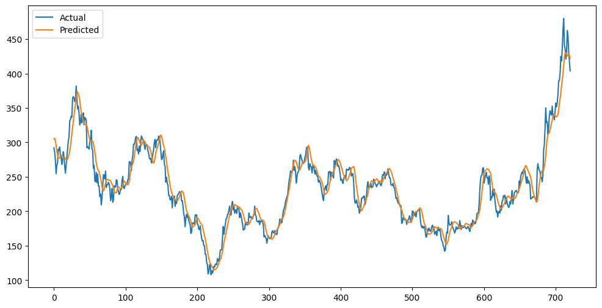
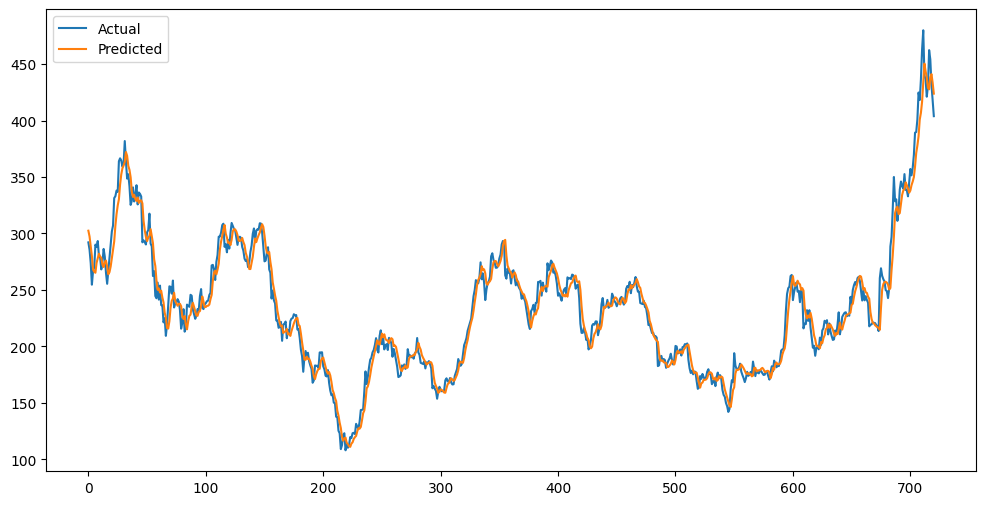

# 📈 Tesla Stock Price Prediction using LSTM & GRU

This project focuses on predicting Tesla (TSLA) stock prices using Deep Learning models (LSTM & GRU) with technical indicators.

---

## 🚀 Project Pipeline
- Data Collection using Yahoo Finance
- Feature Engineering (MA10, MA20, RSI, MACD)
- Data Scaling using MinMaxScaler
- Time-Series Windowing (30 days)
- Model Building (LSTM & GRU)
- Evaluation using RMSE & MAE

---

## 📊 Features Used
- Close Price
- MA10
- MA20
- RSI
- MACD
- Signal Line

---

## 🧠 Models Used

### 🔹 LSTM Model
- 2 LSTM layers (64, 32)
- Dropout (0.2)

### 🔹 GRU Model
- 2 GRU layers (64, 32)
- Dropout (0.2)

---

## 📉 Model Comparison

| Model | RMSE ↓ | MAE ↓ | Training Speed ⚡ | Performance 📊 |
|------|--------|------|------------------|---------------|
| LSTM | 15.45     | 11.70   | Medium           | Good          |
| GRU  | 11.29     |  8.37   | Faster           | Very Good     |

---

## 📸 Predictions Visualization

### 🔹 LSTM Predictions

### 🔹 GRU Predictions

---

## 📦 Tech Stack
- Python
- Pandas & NumPy
- yfinance
- Scikit-learn
- TensorFlow / Keras
- Matplotlib

---

## 🔮 Future Work
- Add Volume & News Sentiment
- Hyperparameter Tuning
- Try Transformers
- Deploy using Streamlit

---

## 👨‍💻 Author
Abdulrahman Hamada

